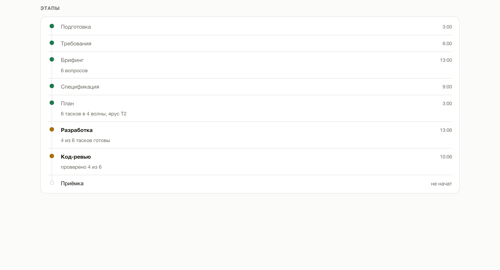
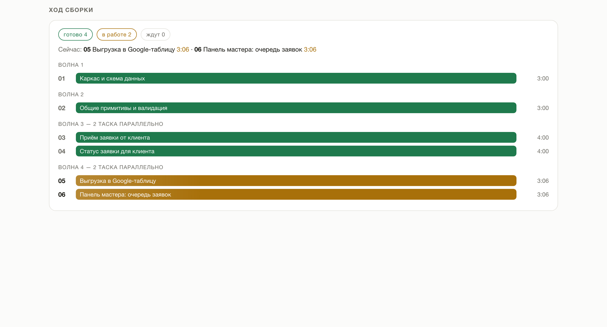
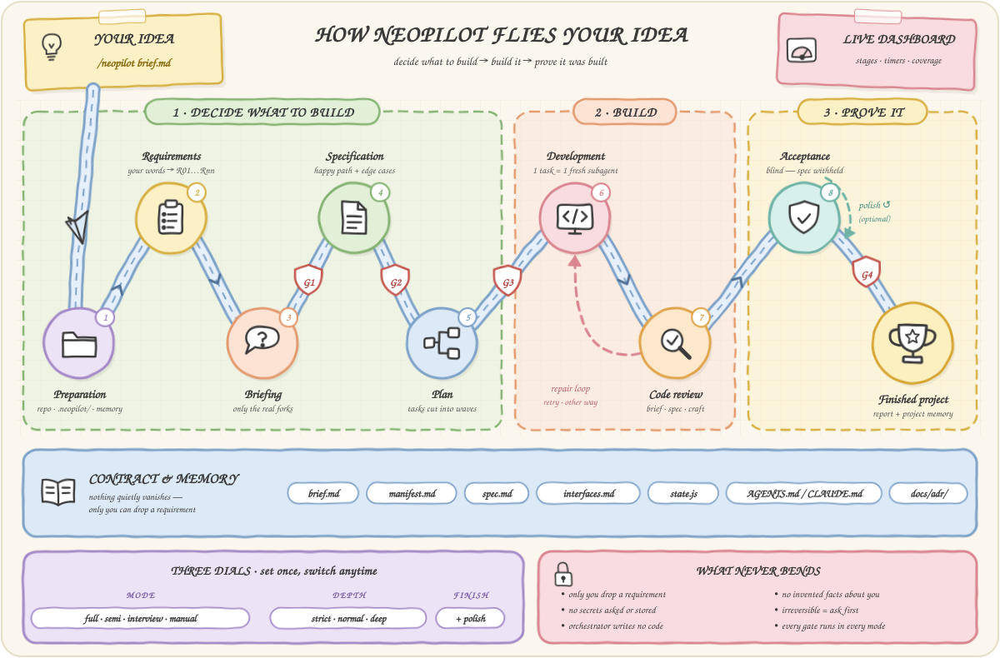

<p align="center">
  <picture>
    <source media="(prefers-color-scheme: dark)" srcset="assets/neopilot-logo-dark.png">
    <source media="(prefers-color-scheme: light)" srcset="assets/neopilot-logo-light.png">
    
  </picture>
</p>

<p align="center">
  <a href="https://skills.sh/Atlantic83/neopilot"></a>
</p>

<p align="center"><strong>Describe in words what you need built — get a finished project.</strong></p>

NeoPilot is a development framework, a skill that takes your idea, asks questions exactly where the idea has real forks, and then writes the specification itself, thinks through what you didn't, breaks the work into tasks, and assembles the whole project. You don't need to read the specification, estimate tasks, or understand code.


<p align="center">
  <a href="assets/neopilot-dashboard.png"></a>
  <a href="assets/neopilot-dashboard.png"></a>
  <a href="assets/neopilot-dashboard.png"></a>
</p>

<p align="center"><sub>Metrics · stages · build progress — <a href="assets/neopilot-dashboard.png">open the full dashboard</a></sub></p>

**And you can see what's happening at all times.** At the start of a build the agent opens the dashboard itself — a single HTML file you don't have to find or launch. It shows how much of the project is already done, how much of your task is covered, which stage the build is at, what is happening right now, and how much is left. Timers run live, the page refreshes itself, no internet needed.

---

## How it works

<p align="center">
  
</p>

The main principle: **the process is the product**. Code is written in the penultimate phase; everything before it is finding out what exactly to build, everything after it is proving that exactly that was built.

| Phase | What happens |
|---|---|
| **Preparation** | Project folder setup, `.gitignore`, instruments — the dashboard opens immediately |
| **Requirements** | Your text → numbered requirements, verbatim |
| **Briefing** | Questions only about real forks, first the ones without which the project can't be built: payment, hosting, access |
| **Specification** | Requirements unfold into worked-out scenarios |
| **Plan** | The specification is cut into tasks — or not cut, if the task is small — and laid out into waves: what can be built simultaneously and what only in sequence |
| **Development** | One task = one separate agent with clean memory, one commit; independent tasks run in parallel |
| **Code review** | After every task: conformance to the brief, conformance to the specification, code quality |
| **Acceptance** | A separate agent launches the project and checks the result against your original task; a project description for the future; a report |

## Installation

### If you don't want to open a terminal

Open your AI agent — Claude Code, Cursor, Codex — and paste this text:

```
Install the NeoPilot skill for me. Run in the terminal:

npx skills add Atlantic83/neopilot --skill neopilot -g -y -a <insert yourself: claude-code, cursor, codex>

If npx is not found — give me a link to download Node.js and wait.
Don't install anything else.
When done — reply in one line that it's ready and that the session needs restarting.
```

The agent will do everything itself. Then restart it — skills are loaded at startup.

This is the command for a **first-time** install. To update later — [a different command](#updating-and-removing).

### Via the terminal

Copy this line:

```bash
npx skills add Atlantic83/neopilot -g
```

The installer will ask which agents to install for — just confirm. The `-g` flag installs the skill globally, so it's available in all your projects.

<details>
<summary>One-command install, no questions</summary>

```bash
npx skills add Atlantic83/neopilot --skill neopilot -a claude-code -g -y
```

| Flag | What it does |
|------|--------------|
| `--skill neopilot` | Installs only NeoPilot |
| `-a claude-code` | Installs for Claude Code |
| `-g` | Globally — the skill is available in all projects |
| `-y` | Don't ask questions |

Without `-g` the skill is installed only into the current project folder.

</details>

**Requires:** [Node.js](https://nodejs.org) (for `npx`) and any supported AI agent — Claude Code, Cursor, Codex and [70+ others](https://github.com/vercel-labs/skills#supported-agents). Nothing else.

<details>
<summary>Claude Code plugin marketplace</summary>

In Claude Code:

```
/plugin marketplace add Atlantic83/neopilot
/plugin install neopilot@neopilot
```

</details>

<details>
<summary>Without Node.js — manual install</summary>

The skill is just the `skills/neopilot` folder. Clone the repo and copy it into your agent's global skills directory:

```bash
git clone https://github.com/Atlantic83/neopilot
cp -r neopilot/skills/neopilot ~/.claude/skills/          # Claude Code
cp -r neopilot/skills/neopilot ~/.agents/skills/          # Codex, Cline, Warp, Zed…
cp -r neopilot/skills/neopilot ~/.config/agents/skills/   # Amp, Replit…
```

Or download the repo as ZIP (Code → Download ZIP) and unpack `skills/neopilot` the same way.

</details>

---

## How to use

Open the agent in the folder of your future project and write:

```
/neopilot I want a Telegram bot that accepts repair service requests
and saves them into a Google Sheet
```

Or simply describe the task in your own words — the agent will understand it's time to turn on NeoPilot:

> Build me a turnkey landing page for a nail studio, don't ask unnecessary questions

**If the task is large — put it in a file.** A detailed description won't fit into a single chat line, and there's no reason to skimp: the more you tell it, the less it has to guess for you. Create a file next to the project — any name works, `brief.md`, `idea.txt`, `task.md` — and describe everything in free form: what the project is, who it's for, what it must do, what you dislike about competitors, what budget and deadline constraints exist. Then just point to it:

```
/neopilot brief.md
```

```
/neopilot deep docs/idea.md but no card payments
```

The agent will read the file and take its contents as the task; your file stays untouched, while a copy lands in `.neopilot/` — that copy is what the final result is checked against. Words written next to the path go into the same task.

After that you'll only need to answer a few questions at the very beginning.

In response, the agent will first say which mode it's running in and what other modes exist, and **will open the dashboard itself** — so there's no need to remember commands or hunt for files:

```
Mode: semi-auto · depth: normal — I'll only ask what the task leaves undefined, then build it myself.
Dashboard opened — it refreshes itself.
Project memory — AGENTS.md (+ CLAUDE.md with a link). Tell me if you need a different one.

You can switch at any time, just say:
• "full auto" — I won't ask anything at all
• "manual mode" — you approve the specification and the task list with me
• "strict to the brief" / "think it through deeply" — less or more elaboration beyond what was said
```

---


## Three modes

After `/neopilot` you can add how closely you want to be involved. Wrote nothing — **semi-auto** runs.

| Mode | How to enable | What it asks you |
|---|---|---|
| **Full auto** | `/neopilot full ...` or "full auto" | Nothing. At the end — a list of decisions made on your behalf |
| **Semi-auto** *(default)* | nothing to add | Only what the task leaves undefined: usually 2–8 questions. If everything is unambiguous — none; if the task is big and raw — as many as needed |
| **Manual** | `/neopilot manual ...` or "manual mode" | Questions, then your "ok" on the specification and on the task list |

```
/neopilot full pizza delivery landing page

/neopilot Telegram bot for nail appointment booking

/neopilot manual CRM for a car service, I want to approve the spec myself
```

The words `full`, `semi`, `manual` are written without hyphens. The mode can be changed mid-flight — "switch to manual", it applies from the next stage.

**What never changes in any mode:** the agent asks before anything irreversible — publishing, payments, mass mailouts, deleting data. And no mode disables the check against your original task.

---

## Depth of elaboration

A separate control, independent of the mode. The mode decides **how much you're asked**; depth decides **how much is thought through for you**.

| Depth | How to enable | What the agent does |
|---|---|---|
| **Strict** | `/neopilot strict ...` or "strict to the brief", "don't add anything" | Only what you wrote. No features of its own — even good ones. Errors and empty states are still handled: without them a requirement simply doesn't work |
| **Normal** *(default)* | nothing to add | Elaborates where a gap would clearly spoil the result. It may add something of its own, but always anchored to your requirement |
| **Maximum** | `/neopilot deep ...` or "think it through deeply", "think for me" | Every requirement is run through the full checklist: first launch, empty screen, invalid input, refusal, disconnection, growth, permissions, consequences |

```
/neopilot strict feedback form, exactly as described

/neopilot deep ceramics online store

/neopilot full deep marketplace for handymen
```

Word order doesn't matter, both parameters are optional. Depth, like mode, can be changed mid-flight: "less invention" or "think deeper".

**One rule applies at any depth:** everything the agent adds on its own is anchored to your requirement and appears in the final report as a separate list. A feature anchored to nothing gets cut.

---

## Polish to a benchmark

The third control, and the only one that costs noticeable money and time. **Off by default.**

```
/neopilot polish nail studio landing page
```

Enabled by the word `polish` or "polish it", "make it perfect", "compare against the benchmark". What happens: once the project is built and accepted, the agent launches it, puts the result next to **your** benchmark, and looks for concrete differences. What it finds becomes ordinary tasks — with review, tests, and separate commits — and the loop repeats.

**The benchmark is what you provide.** Sites it should resemble; a screenshot; text whose tone you like; a number to beat. The agent asks for all of this once during the briefing and stores it in `reference.md`.

Without a benchmark, polishing **does not start** — and that's the main thing about it. A critic with nothing to compare against has to invent the benchmark itself, and then the build honestly drives toward a standard nobody chose. So if there's nothing to compare with, the agent says so in one line and moves on to the report.

Three ways to stop, the first one wins: a loop found nothing new, three loops have passed, or you said "enough". "Until the critic is satisfied" is not a condition: it will never be satisfied — that's its job. And a loop that broke something is rolled back in full, not fixed by the next loop.

Polish isn't appropriate everywhere. Where quality is visible and there's something to compare against — interfaces, landing pages, copy — it gives the most. For internal logic with a clear specification, there's already a judge: tests.

---

## Two things NeoPilot does differently

### Your task doesn't get lost along the way

The usual problem with building "from a description": you dictated a big brief, then came questions, a specification, tasks, code — and at the output, half of what you asked for is simply missing. Not because it was refused, but because at some step it stopped being mentioned.

NeoPilot's first move is to break your text into **numbered requirements** and record them verbatim in a file. From then on every requirement has a status, and every stage has a check:

- after the specification — no requirement is left without a section;
- after the breakdown — every requirement has a task, **and every task has a requirement** (this catches work nobody ordered);
- at the end — **blind acceptance**: a separate agent receives only your original text and the finished project; it is not given the specification. It checks the result against your words, not against a retelling. If it and the tracker disagree — you'll see it in the report.

**Only you can drop a requirement.** The agent may propose postponing one — it may not strike one out. Silence does not count as cancellation.

### What you didn't think about gets thought through for you

In a brief you describe how everything works when everything goes well. You don't describe what to show on an empty screen, what happens when the connection drops, what happens if "send" is pressed twice, and what a person sees on the very first launch. That's not an omission — it's simply not the level at which tasks are formulated.

Thinking this through is most of NeoPilot's value, and you set the volume of that work with [depth](#depth-of-elaboration). At normal depth the agent closes gaps that would clearly spoil the result; at maximum — it runs every requirement through the full checklist. Some of it it decides itself (error text, reasonable limits), and some — where the decision is truly yours — it puts into questions.

At maximum depth a single requirement from the brief unfolds into several worked-out scenarios — as many as it genuinely has facets. That's the difference between "works in a demo" and "works".

---

## Progress is always visible

`.neopilot/dashboard.html` **opens by itself** at the very start of the build — nothing to find or launch. If the agent can show a page inside its own window (for example, a panel in the Claude app), the dashboard opens there and everything stays in one window; otherwise — in an external browser. Works offline, no server. While the build runs, the page pulls fresh numbers every ten seconds — without reloading, so your scroll position and selected text are preserved; the ⟳ button at the top turns that off if it gets in the way. Next to it — theme (light / dark) and language (RU / EN) toggles; until you touch the theme, the dashboard follows the system one. The mode, depth, and tier badges are color-coded: the blue family — mode, violet — depth, ochre — workload; saturation grows with the value.

**Every stage of the cycle in plain sight.** Eight steps from preparation to acceptance: preparation, requirements, briefing, specification, plan, development, code review, acceptance. You can see which are done, which is running now, which were skipped and why ("tier T0 — no task breakdown", "full auto — self-briefing"), and which are still ahead.

**Time runs in real time.** The overall build timer, the current stage timer, and the current task timer tick every second; finished stages and completed tasks show how long each took. When the build ends, the clocks stop at the final numbers.

**Build progress — what's done and what's happening right now.** As soon as the plan is cut, all tasks are visible at once: how many are done, how many in flight, how many are waiting their turn. Running tasks are listed by name, each with a ticking timer; finished ones — with the time they took. Tasks that don't depend on each other are built in parallel, and here you can see how many are flying at once.

**The bar at the top — progress of the entire project**, from zero to finished result. It accounts for both completed stages and the share of finished tasks inside development, so it creeps forward with every task instead of sitting still for half a day.

| Metric | What it means |
|---|---|
| **Project progress** | One number for "how much is left" — across stages and tasks together |
| **Brief coverage** | How many of your requirements are actually closed. The key number: tasks can be 100% done while the brief is at 70% |
| **Current stage** | Where the build is in the cycle and how long this stage has been running |
| Elapsed / remaining | Total time and a critical-path estimate — by the longest chain of dependent tasks, not by the sum of what's left |
| Tasks | How many are done out of how many, and how many are in flight right now. On small builds — "no breakdown": there are no tasks by design |
| **Debt** | Stubs, decisions made on your behalf, unfilled variables. This is what separates "works" from "works for you" |
| Tests | How many passed after each task — regression is visible immediately, not at the end |
| Retries and time per task | Shows where the build was spinning its wheels |

Even when the project is small and there's no point breaking it into tasks, the dashboard isn't empty: stages, requirements, tests, commit, and stubs are filled in the same way. If the session was interrupted — say "resume neopilot"; the agent will pick the state up from the files and continue from where it stopped.

---

## The project remembers itself

The usual pain of a second session: the agent opens a finished project and spends half an hour figuring out what was even built here — on your dime. NeoPilot closes this with a project description file in the root: `AGENTS.md` or `CLAUDE.md` — whichever your agent reads.

The file appears **immediately**, before the first line of code: name, stack, run commands. After that, only what was genuinely learned along the way lands there — the real test command, pitfalls already stepped on, a new environment variable. And at the very end a separate agent reads the **finished code** (not the specification — otherwise the description would be telling you about plans) and writes up the architecture: how the parts connect, what lives where, what must not be touched.

| | |
|---|---|
| Which file | Determined automatically: working in Claude Code — `CLAUDE.md`; in Cursor or Codex — `AGENTS.md`. One of them already exists — we write into it. Unclear — `AGENTS.md`, with `CLAUDE.md` next to it containing a one-line link |
| Size | Scaled to the project: a landing page gets commands, structure, and pitfalls; a big project — plus key files, conventions, variables, and tests |
| Your text | Everything you wrote is inviolable. NeoPilot writes only inside its own markers and never touches the rest |

You won't be asked about this — at the start of the build you'll get one line: "Project memory — AGENTS.md". Wrong file — just say so, it will be changed.

---

### About cutting into tasks

Every task is a separate agent that gets up to speed on the project from scratch: reads the contracts, studies the code, figures out the stack. That's expensive. So NeoPilot cuts by tiers, not "the finer the safer":

| Task | How many tasks |
|---|---|
| Small — a landing page, a form, a script | **zero.** Built in a single pass |
| One coherent feature | 2–3 |
| Several features or layers | 4–8 |
| Several independent subsystems | 9–16 |

More than 16 is forbidden: the work is split into two runs. Fine slicing doesn't buy reliability — it buys expense.

### About development

| What NeoPilot does | Why |
|---|---|
| Each task is executed by a separate agent | Doesn't get confused by accumulated context and doesn't break what worked |
| Passes previous agents' contracts to the next one | Otherwise task six re-invents what task three built |
| Independent tasks run in parallel, several agents at once | Waiting in line for things that don't depend on each other is hours wasted on nothing |
| One commit per task | Your rollback points |
| Tasks sharing files run in sequence | Otherwise two agents overwrite each other's work |
| Full test run after each task | Regression costs minutes, not an evening |
| Post-review fixes are made by the same agent that wrote the code | It remembers why the code is the way it is; a stranger fixes the symptom and breaks the cause |
| The main dialog never writes code — it only delegates and verifies | Its single context lasts the whole run and isn't refreshed: every diff read on task two gets in the way on task eight |
| A failed task — a retry, then an attempt a different way | If that fails too, the agent stops and explains in plain language |
| A plan that diverged from the code is corrected out loud | If it turns out mid-way that the plan doesn't work, the agent fixes the plan and tells you in one line — instead of silently building something else |

---

## When to use it and when not to

**A good fit if:**

- you describe what you need and wait for a finished result;
- you're not a programmer and won't read specifications or code;
- "build it turnkey", "just build it", "don't ask unnecessary questions";
- you want to approve the specification and task list but not fuss with the process — that's manual mode.

**Not a fit if:**

| Situation | What to do instead |
|---|---|
| You want to write code together, line by line | Work with the agent directly |
| The task is an edit in a single file | Just ask for it |
| The idea is bigger than one project, the end goal unclear | Decide on the goal first |

---

## Keys, passwords, and access

NeoPilot **never asks for keys, tokens, or passwords** — only which service you want to use and whether you have an account there.

- the question will be "do we take payment via Stripe or PayPal?", not "send me the key";
- the code will contain a variable name — `STRIPE_SECRET_KEY`; you enter the value into `.env` yourself;
- `.env` goes into `.gitignore` right away;
- the report lists variables left to fill in — names without values.

If you do send a key in the chat, it **will not land in any file**: before being written, all your text passes through a filter that recognizes Stripe, GitHub, AWS, Google, and Slack keys, Telegram tokens, JWTs, and connection strings. Instead of the value, `[REDACTED:STRIPE_SECRET_KEY]` goes into the file, and you get a warning — a key that has been through correspondence should be revoked and reissued.

---

## What NeoPilot never does

- never writes code before a specification exists;
- never strikes out your requirements — only you can;
- never invents facts about you: prices, copy, and addresses remain visible placeholders, not plausible lies;
- never asks you to check tasks, their size, or code;
- never runs two tasks in one agent's memory;
- never leaves payment, access, and hosting for the finish line;
- never asks for or stores your keys and passwords;
- never installs or downloads anything without your knowledge.

---

## Updating and removing

**Only `update` updates.** Don't reinstall the skill with the command from the "Installation" section — that's for first-time installs; there's a separate command for updating:

```bash
npx skills update neopilot -g
```

The `-g` flag — if the skill was installed globally. For a project-level install, run the command without the flag inside that project's folder.

If you don't want to open a terminal — paste this to the agent:

```
Update the NeoPilot skill to the latest version. Run in the terminal:

npx skills update neopilot -g

If it replies that everything is already up to date but the version is old — reinstall:
npx skills remove neopilot -g -y && npx skills add Atlantic83/neopilot --skill neopilot -g -y -a <insert yourself: claude-code, cursor, codex>

When done — reply in one line with what was updated, and remind me to restart the session.
```

See what's installed, and remove:

```bash
npx skills list
```

```bash
npx skills remove neopilot -g
```

**If the skill behaves like an old version.** `update` checks the source version, not the files on disk: if the local copy was edited or corrupted, it will answer "already up to date" and do nothing. Fixed by reinstalling:

```bash
npx skills remove neopilot -g -y && npx skills add Atlantic83/neopilot --skill neopilot -g -y -a claude-code
```

For the agent to see the new version, **restart the session** — skills are loaded at startup.

---

## Architecture

Who talks to whom during a build. The orchestrator holds the whole run but writes no code: it records your brief as a contract, hands tasks to fresh subagents, and tracks the run state that feeds the dashboard. Every diff is reviewed, and the finished project is checked by an agent that sees only your original brief.

<p align="center">
  
</p>

---

## What's inside the repository

```
skills/neopilot/
├── SKILL.md                    ← orchestrator: modes, phases, gates
├── phases/                    ← phase rules, read one at a time, when the phase starts
│   ├── 0-preflight.md          repository preparation
│   ├── 0-instruments.md        bring up the dashboard: template, initial state, ritual
│   ├── 0-memory.md             choose the project memory file and write the skeleton
│   ├── 1-manifest.md           brief → requirements, secrets filter
│   ├── 2-briefing.md           questions to the user, benchmark collection
│   ├── 3-spec.md               specification and depth elaboration
│   ├── 4-plan.md               task breakdown, tiers
│   ├── 5-subagents.md          executor agents and contracts between them
│   ├── 6-review.md             three-axis check
│   ├── 7-instruments.md        state and dashboard — read when tasks are cut
│   ├── 8-final.md              blind acceptance and report
│   ├── 9-memory.md             project description in CLAUDE.md / AGENTS.md
│   ├── polish.md               polish to a benchmark — only when enabled
│   └── dashboard-template.html ready-made dashboard with embedded logo
└── prompts/                   ← material for subagents, not for the orchestrator
    └── craft-review.md         what the code-quality reviewer judges by

assets/                         ← logo
```

The `phases/` files are read by the agent one at a time, only when the corresponding phase begins — so memory always holds exactly what's needed right now.

The unit of loading is a file, not a section: you can't read "just the top part", the whole thing is read. That's why what phase 0 needs from the dashboard and from project memory is split into `0-instruments.md` and `0-memory.md` — otherwise the start of a build would drag in two big files for a few paragraphs. For the same reason `polish.md` isn't opened until polish is requested, and `prompts/` travels to the subagent along its path without settling in the orchestrator's context.

All of this is ordinary markdown. You can open it and read it: [skills/neopilot/SKILL.md](skills/neopilot/SKILL.md).

---

## License

[MIT](LICENSE) © Atlantic83 — free to use, modify, and distribute, including in commercial projects.
