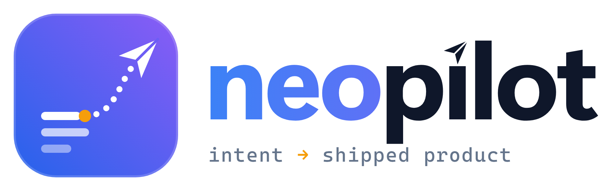
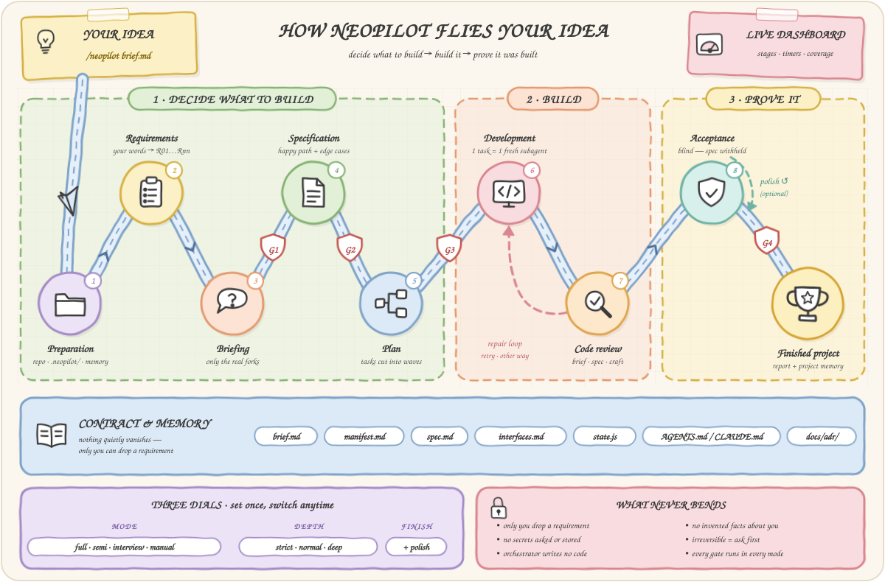
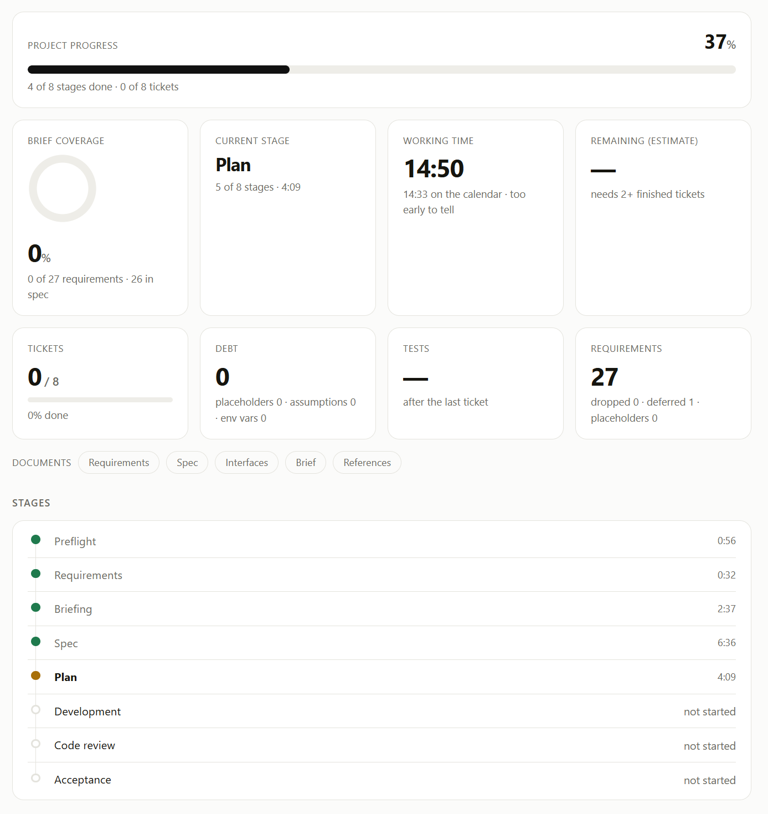
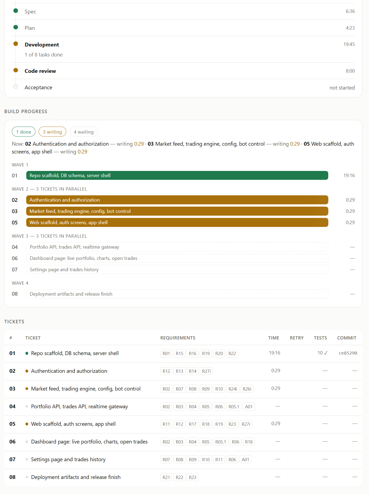
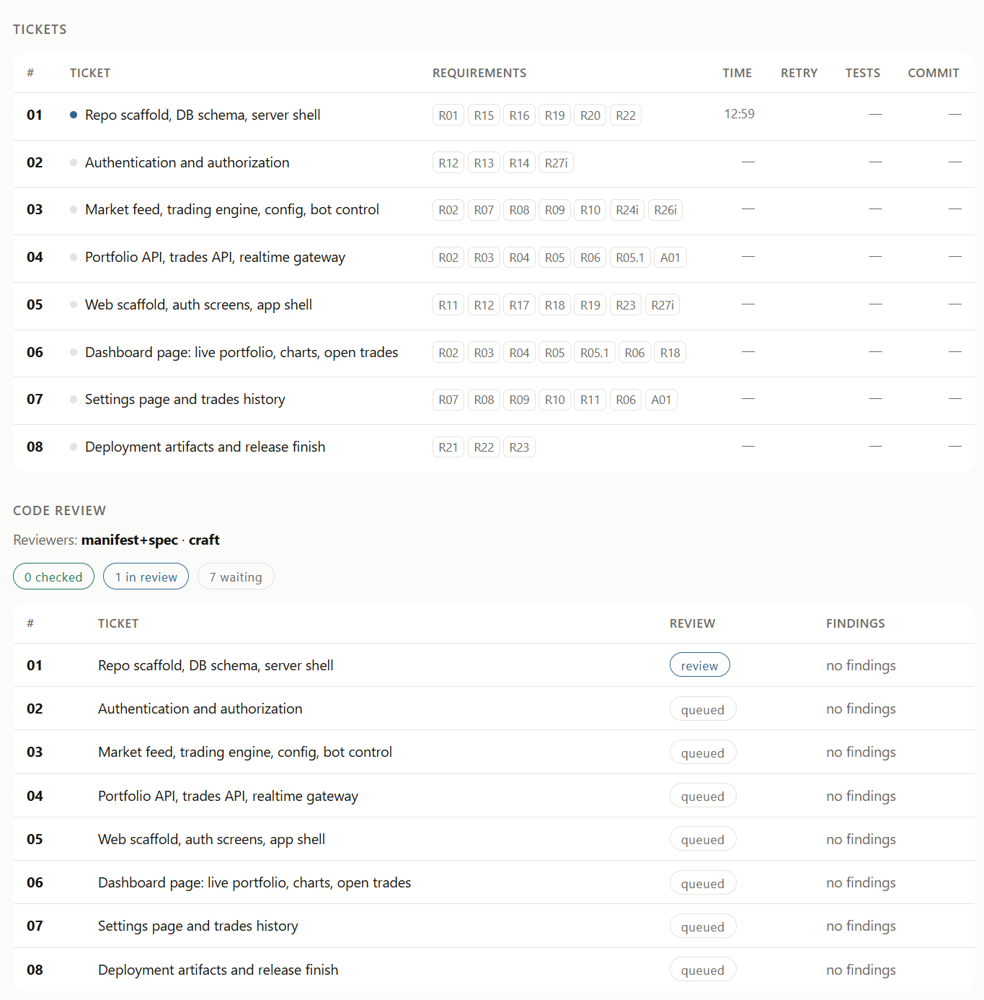

<div align="center">

<picture>
  <source media="(prefers-color-scheme: dark)" srcset="assets/neopilot-logo-dark.png">
  <source media="(prefers-color-scheme: light)" srcset="assets/neopilot-logo-light.png">
  
</picture>

### Describe in words what you need built — get a finished project.

*Your words are the contract. The process is the product.*

[](https://skills.sh/Atlantic83/neopilot) [](LICENSE) [](https://github.com/vercel-labs/skills#supported-agents) [](#-quick-start) [](#-quick-start)

<br>

**A skill for AI coding agents that flies a dictated idea from words to a working project — in one dialogue.**

NeoPilot takes your idea, asks questions only where the idea has real forks, writes the specification itself, thinks through what you didn't, breaks the work into tasks, and assembles the whole project with fresh subagents. You don't need to read the specification, estimate tasks, or understand code — and at the end, an agent that has seen only your original words checks that you got what you asked for.

<br>

[Quick Start](#-quick-start) · [How It Works](#-how-it-works) · [Three Dials](#-three-dials) · [Commands](#-command-reference) · [Dashboard](#-live-dashboard) · [Architecture](#-architecture)

</div>

---

> **Safety:** NeoPilot **never asks for keys, tokens, or passwords** and redacts any it sees before they reach a file. It **asks before anything irreversible** — publishing, payments, mass mailouts, deleting data, rewriting history. It **never invents facts about you**: prices, copy, and addresses stay visible placeholders. In your project memory file it writes only between its own markers — everything you wrote stays untouched.

---

## 🤔 Why NeoPilot?

The usual problem with building "from a description": you dictate a big brief, then come questions, a specification, tasks, code — and at the output, half of what you asked for is simply missing. Not because it was refused, but because at some step it stopped being mentioned. And meanwhile *you* are the one running the pipeline: knowing which step fires next, remembering where the last session stopped.

NeoPilot treats **your original words as the contract**. They become numbered requirements before anything else happens, every stage is gated against them, and nothing checks the result against a paraphrase — only against what you actually said.

| | Typical "build it from a description" | NeoPilot |
|---|---|---|
| Source of truth | The agent's own spec — a retelling of your words | Your words, recorded verbatim as numbered requirements |
| Dropped requirements | Silently vanish somewhere around the third rewrite | Only you can drop one — in your own words |
| Final check | "Does the code match the spec?" | **Blind acceptance**: "does the result match the brief?" — spec withheld |
| Who runs the pipeline | You: which step next, where it stopped | The orchestrator — one dialogue, say "resume" after a break |
| Your involvement | Baked into the design | A dial: from "ask me nothing" to "I approve the spec and the plan" |
| Edge cases | Whatever you remembered to mention | Worked out for you, as deep as you set the dial |
| Progress | Buried in tickets and logs | A live dashboard that opens itself |
| Second session | Half an hour figuring out what was built | `AGENTS.md` / `CLAUDE.md` written from the finished code |

---

## ✨ Key Features

| | Feature | Description |
|---|---|---|
| 📜 | **Brief as contract** | Your text → numbered requirements `R01…Rnn`, verbatim; every one has a status until the end |
| 🚦 | **Four gates** | G1–G4 check the brief after briefing, spec, plan, and acceptance — no mode can switch them off |
| 🙈 | **Blind acceptance** | A separate agent gets only your original text and the finished project, never the spec |
| 🎛 | **Three dials** | Mode (how much you're asked), depth (how much is thought through), polish (compare to a benchmark) |
| 🧩 | **Fresh subagents** | One task = one agent with clean context and one commit; independent tasks run in parallel |
| 🔍 | **Review after every task** | Conformance to the brief, to the spec, and code quality — fixed by the agent that wrote the code |
| 📊 | **Live dashboard** | Opens by itself: stages, timers, brief coverage, tasks in flight, debt — offline, no server |
| ⏯ | **Resume anywhere** | State lives in `state.js`; say "resume neopilot" and the build continues where it stopped |
| 🧠 | **Project memory** | `AGENTS.md` / `CLAUDE.md` from step one, architecture written from the finished code, ADRs |
| 🔐 | **Secrets policy** | Never requested, redacted at ingest, referred to only by variable name |
| 📦 | **Standalone** | Plain markdown, nothing else to install — works in Claude Code, Cursor, Codex, and 70+ agents |

---

## 🔄 How It Works

<p align="center">
  
</p>

The main principle: **the process is the product**. Code is written in the penultimate phase; everything before it is finding out what exactly to build, everything after it is proving that exactly that was built.

| # | Stage | What happens |
|---|---|---|
| 1 | **Preparation** | Project folder setup, `.gitignore`, instruments — the dashboard opens immediately |
| 2 | **Requirements** | Your text → numbered requirements, verbatim |
| 3 | **Briefing** | Questions only about real forks, first the ones without which the project can't be built: payment, hosting, access |
| 4 | **Specification** | Requirements unfold into worked-out scenarios |
| 5 | **Plan** | The specification is cut into tasks — or not cut, if the task is small — and laid out into waves: what can be built simultaneously and what only in sequence |
| 6 | **Development** | One task = one separate agent with clean memory, one commit; independent tasks run in parallel |
| 7 | **Code review** | After every task: conformance to the brief, conformance to the specification, code quality |
| 8 | **Acceptance** | A separate agent launches the project and checks the result against your original task; a project description for the future; a report |

**The gates** — a failed gate is not a warning, it sends the stage back to be redone:

| Gate | After | Passes when |
|---|---|---|
| **G1** | Briefing | Every requirement has a status; none left open without a recorded reason |
| **G2** | Specification | Every live requirement is in the spec, deferred, or dropped by you — and an independent reader given only the brief and the spec finds nothing missing |
| **G3** | Plan | Every requirement maps to at least one task, **and every task traces back to a requirement** — this catches work nobody ordered |
| **G4** | Acceptance | Blind acceptance against the brief, spec withheld; every disagreement with the tracker is reported to you |

---

## 🚀 Quick Start

**Requires:** [Node.js](https://nodejs.org) (for `npx`) and any supported AI agent — Claude Code, Cursor, Codex and [70+ others](https://github.com/vercel-labs/skills#supported-agents). Nothing else.

> On macOS? Use the macOS build: [`Atlantic83/neopilot-macos`](https://github.com/Atlantic83/neopilot-macos).

### 1. Install

**If you don't want to open a terminal** — open your AI agent and paste this text:

```
Install the NeoPilot skill for me. Run in the terminal:

npx skills add Atlantic83/neopilot --skill neopilot -g -y -a <insert yourself: claude-code, cursor, codex>

If npx is not found — give me a link to download Node.js and wait.
Don't install anything else.
When done — reply in one line that it's ready and that the session needs restarting.
```

**Via the terminal:**

```bash
npx skills add Atlantic83/neopilot -g
```

The installer will ask which agents to install for — just confirm. The `-g` flag installs the skill globally, so it's available in all your projects. Then **restart the agent** — skills are loaded at startup.

This is the command for a **first-time** install. To update later — [a different command](#-updating-and-removing).

<details>
<summary>One-command install, no questions</summary>

```bash
npx skills add Atlantic83/neopilot --skill neopilot -a claude-code -g -y
```

| Flag | What it does |
|------|--------------|
| `--skill neopilot` | Installs only NeoPilot |
| `-a claude-code` | Installs for Claude Code |
| `-g` | Globally — the skill is available in all projects |
| `-y` | Don't ask questions |

Without `-g` the skill is installed only into the current project folder.

</details>

<details>
<summary>Claude Code plugin marketplace</summary>

```
/plugin marketplace add Atlantic83/neopilot
/plugin install neopilot@neopilot
```

</details>

<details>
<summary>Without Node.js — manual install</summary>

The skill is just the `skills/neopilot` folder. Clone the repo and copy it into your agent's global skills directory:

```bash
git clone https://github.com/Atlantic83/neopilot
cp -r neopilot/skills/neopilot ~/.claude/skills/          # Claude Code
cp -r neopilot/skills/neopilot ~/.agents/skills/          # Codex, Cline, Warp, Zed…
cp -r neopilot/skills/neopilot ~/.config/agents/skills/   # Amp, Replit…
```

Or download the repo as ZIP (Code → Download ZIP) and unpack `skills/neopilot` the same way.

</details>

### 2. Describe what to build

Open the agent in the folder of your future project and write:

```
/neopilot I want a Telegram bot that accepts repair service requests
and saves them into a Google Sheet
```

Or simply describe the task in your own words — the agent will understand it's time to turn on NeoPilot:

> Build me a turnkey landing page for a nail studio, don't ask unnecessary questions

### 3. Big task? Put it in a file

A detailed description won't fit into a single chat line, and there's no reason to skimp: the more you tell it, the less it has to guess for you. Create a file next to the project — any name works, `brief.md`, `idea.txt`, `task.md` — and describe everything in free form: what the project is, who it's for, what it must do, what you dislike about competitors, what budget and deadline constraints exist. Then point to it:

```
/neopilot brief.md
/neopilot deep docs/idea.md but no card payments
```

The agent reads the file and takes its contents as the task; your file stays untouched, while a copy lands in `.neopilot/` — that copy is what the final result is checked against. Words written next to the path go into the same task.

### 4. Answer a few questions — and watch

The agent first says which mode it's running in and what other modes exist, and **opens the dashboard itself** — no commands to remember, no files to hunt for:

```
Mode: semi-auto · depth: normal — I'll only ask what the task leaves undefined, then build it myself.
Dashboard opened — it refreshes itself.
Project memory — AGENTS.md (+ CLAUDE.md with a link). Tell me if you need a different one.

You can switch at any time, just say:
• "full auto" — I won't ask anything at all
• "grill me" — I'll take the task apart with questions to the end, then build it myself
• "manual mode" — you approve the specification and the task list with me
• "strict to the brief" / "think it through deeply" — less or more elaboration beyond what was said
```

After the opening questions you're free: the build runs to the end, and the final report lists what was built, what was decided on your behalf, and what is left for you to fill in.

---

## 🎛 Three Dials

Everything typed after `/neopilot` splits into four parts: **mode**, **depth**, **finish**, and the **brief** (everything else). Bare words, no hyphens, any order — anything unrecognised is brief. Each dial can be turned mid-run; the change applies from the next stage.

### Mode — how much you're asked

| Mode | How to enable | What it asks you |
|---|---|---|
| **Full auto** | `/neopilot full ...` or "full auto" | Nothing. At the end — a list of decisions made on your behalf |
| **Semi-auto** *(default)* | nothing to add | Only what the task leaves undefined: usually 2–8 questions. If everything is unambiguous — none; if the task is big and raw — as many as needed |
| **Interview** | `/neopilot interview ...` or "grill me", "interview me" | Takes the idea apart with you question by question, to the end — then builds it without you |
| **Manual** | `/neopilot manual ...` or "manual mode" | Everything interview asks, plus your "ok" on the specification and on the task list |

### Depth — how much is thought through for you

| Depth | How to enable | What the agent does |
|---|---|---|
| **Strict** | `/neopilot strict ...` or "strict to the brief", "don't add anything" | Only what you wrote. No features of its own — even good ones. Errors and empty states are still handled: without them a requirement simply doesn't work |
| **Normal** *(default)* | nothing to add | Elaborates where a gap would clearly spoil the result. It may add something of its own, but always anchored to your requirement |
| **Maximum** | `/neopilot deep ...` or "think it through deeply", "think for me" | Every requirement is run through the full checklist: first launch, empty screen, invalid input, refusal, disconnection, growth, permissions, consequences |

**One rule applies at any depth:** everything the agent adds on its own is anchored to your requirement and appears in the final report as a separate list. A feature anchored to nothing gets cut.

### Polish — compare to a benchmark

The only dial that costs noticeable money and time. **Off by default.** Enabled by the word `polish` or "polish it", "make it perfect", "compare against the benchmark".

Once the project is built and accepted, the agent launches it, puts the result next to **your** benchmark, and looks for concrete differences. What it finds becomes ordinary tasks — with review, tests, and separate commits — and the loop repeats.

- **The benchmark is what you provide**: sites it should resemble, a screenshot, text whose tone you like, a number to beat. The agent asks for it once during the briefing and stores it in `reference.md`.
- **No benchmark — no polishing.** A critic with nothing to compare against has to invent the standard itself, and then the build honestly drives toward a standard nobody chose. So the agent says so in one line and moves on to the report.
- **Three ways to stop, the first one wins:** a loop found nothing new, three loops have passed, or you said "enough". A loop that broke something is rolled back in full, not fixed by the next loop.
- **Where it pays off:** where quality is visible and there's something to compare against — interfaces, landing pages, copy. For internal logic with a clear specification there's already a judge: tests.

### Examples

```
/neopilot full pizza delivery landing page
/neopilot Telegram bot for nail appointment booking
/neopilot manual CRM for a car service, I want to approve the spec myself
/neopilot strict feedback form, exactly as described
/neopilot full deep marketplace for handymen
/neopilot polish nail studio landing page
```

**What never changes in any dial position:** the agent asks before anything irreversible, and no mode disables the check against your original task.

---

## 📖 Command Reference

| You type | What happens |
|---|---|
| `/neopilot <what to build>` | Starts a build in semi-auto mode at normal depth |
| `/neopilot <path/to/brief.md> [extra words]` | Takes the file as the brief; extra words join the same task |
| `full` · `semi` · `interview` · `manual` | Mode — how much you're asked |
| `strict` · `deep` | Depth — less or more elaboration beyond what you said |
| `polish` | After acceptance, compare the result to your benchmark and improve it |
| "switch to manual", "full auto", "grill me" | Change the mode mid-run — applies from the next stage |
| "less invention", "think deeper" | Change the depth mid-run |
| "enough" | Stop the polish loop |
| "resume neopilot" | Pick up an interrupted build from `.neopilot/` and continue |

---

## 📜 Your Brief Is the Contract

### Your task doesn't get lost along the way

NeoPilot's first move is to break your text into **numbered requirements** and record them verbatim in a file. From then on every requirement has a status, and every stage has a check:

- after the specification — no requirement is left without a section;
- after the breakdown — every requirement has a task, **and every task has a requirement** (this catches work nobody ordered);
- at the end — **blind acceptance**: a separate agent receives only your original text and the finished project; it is not given the specification. It checks the result against your words, not against a retelling. If it and the tracker disagree — you'll see it in the report.

**Only you can drop a requirement.** The agent may propose postponing one — it may not strike one out. Silence does not count as cancellation.

### What you didn't think about gets thought through for you

In a brief you describe how everything works when everything goes well. You don't describe what to show on an empty screen, what happens when the connection drops, what happens if "send" is pressed twice, and what a person sees on the very first launch. That's not an omission — it's simply not the level at which tasks are formulated.

Thinking this through is most of NeoPilot's value, and you set the volume of that work with [depth](#depth--how-much-is-thought-through-for-you). At normal depth the agent closes gaps that would clearly spoil the result; at maximum — it runs every requirement through the full checklist. Some of it it decides itself (error text, reasonable limits), and some — where the decision is truly yours — it puts into questions.

At maximum depth a single requirement from the brief unfolds into several worked-out scenarios — as many as it genuinely has facets. That's the difference between "works in a demo" and "works".

---

## 📊 Live Dashboard

<p align="center">
  <a href="assets/dash-metrics.png"></a>
  <a href="assets/dash-stages.png"></a>
  <a href="assets/dash-build.png"></a>
</p>

<p align="center"><sub>Metrics · stages · build progress — click a screenshot for full size</sub></p>

`.neopilot/dashboard.html` **opens by itself** at the very start of the build — nothing to find or launch. If the agent can show a page inside its own window (for example, a panel in the Claude app), the dashboard opens there; otherwise — in an external browser. Works offline, no server.

- **Live, without reloading.** The page pulls fresh numbers every ten seconds and keeps your scroll position and selected text; the ⟳ button turns that off. Theme (light / dark, follows the system until you touch it) and language (RU / EN) toggles sit next to it.
- **Every stage in plain sight.** Which of the eight stages are done, which is running, which were skipped and why ("tier T0 — no task breakdown", "full auto — self-briefing"), and which are still ahead.
- **Time in real time.** The build, current stage, and current task timers tick every second; finished stages and tasks show how long each took. When the build ends, the clocks stop at the final numbers.
- **Build progress.** As soon as the plan is cut, all tasks are visible: done, in flight, waiting. Running tasks are listed by name with a ticking timer; you can see how many are flying in parallel.
- **One bar for the whole project** — it counts both finished stages and finished tasks inside development, so it creeps forward with every task instead of sitting still for half a day.
- **Color-coded badges:** the blue family — mode, violet — depth, ochre — workload; saturation grows with the value.

| Metric | What it means |
|---|---|
| **Project progress** | One number for "how much is left" — across stages and tasks together |
| **Brief coverage** | How many of your requirements are actually closed. The key number: tasks can be 100% done while the brief is at 70% |
| **Current stage** | Where the build is in the cycle and how long this stage has been running |
| Elapsed / remaining | Total time and a critical-path estimate — by the longest chain of dependent tasks, not by the sum of what's left |
| Tasks | How many are done out of how many, and how many are in flight right now. On small builds — "no breakdown": there are no tasks by design |
| **Debt** | Stubs, decisions made on your behalf, unfilled variables. This is what separates "works" from "works for you" |
| Tests | How many passed after each task — regression is visible immediately, not at the end |
| Retries and time per task | Shows where the build was spinning its wheels |

Even when the project is small and there's no point breaking it into tasks, the dashboard isn't empty: stages, requirements, tests, commit, and stubs are filled in the same way. If the session was interrupted — say "resume neopilot"; the agent picks the state up from the files and continues from where it stopped.

---

## 🧠 Project Memory

The usual pain of a second session: the agent opens a finished project and spends half an hour figuring out what was even built here — on your dime. NeoPilot closes this with a project description file in the root: `AGENTS.md` or `CLAUDE.md` — whichever your agent reads.

The file appears **immediately**, before the first line of code: name, stack, run commands. After that, only what was genuinely learned along the way lands there — the real test command, pitfalls already stepped on, a new environment variable. And at the very end a separate agent reads the **finished code** (not the specification — otherwise the description would be telling you about plans) and writes up the architecture: how the parts connect, what lives where, what must not be touched.

| | |
|---|---|
| Which file | Determined automatically: working in Claude Code — `CLAUDE.md`; in Cursor or Codex — `AGENTS.md`. One of them already exists — we write into it. Unclear — `AGENTS.md`, with `CLAUDE.md` next to it containing a one-line link |
| Size | Scaled to the project: a landing page gets commands, structure, and pitfalls; a big project — plus key files, conventions, variables, and tests |
| Your text | Everything you wrote is inviolable. NeoPilot writes only inside its own markers and never touches the rest |
| Decisions | Reasoning worth outliving the run — why this data model, what the build proved wrong — goes to `docs/adr/` on bigger builds |

You won't be asked about this — at the start of the build you'll get one line: "Project memory — AGENTS.md". Wrong file — just say so, it will be changed.

---

## 🔧 Under the Hood

### Cutting into tasks

Every task is a separate agent that gets up to speed on the project from scratch: reads the contracts, studies the code, figures out the stack. That's expensive. So NeoPilot cuts by tiers, not "the finer the safer":

| Task | How many tasks |
|---|---|
| Small — a landing page, a form, a script | **zero.** Built in a single pass |
| One coherent feature | 2–3 |
| Several features or layers | 4–8 |
| Several independent subsystems | 9–16 |

More than 16 is forbidden: the work is split into two runs. Fine slicing doesn't buy reliability — it buys expense.

### Development

| What NeoPilot does | Why |
|---|---|
| Each task is executed by a separate agent | Doesn't get confused by accumulated context and doesn't break what worked |
| Passes previous agents' contracts to the next one | Otherwise task six re-invents what task three built |
| Independent tasks run in parallel, several agents at once | Waiting in line for things that don't depend on each other is hours wasted on nothing |
| One commit per task | Your rollback points |
| Tasks sharing files run in sequence | Otherwise two agents overwrite each other's work |
| Full test run after each task | Regression costs minutes, not an evening |
| Post-review fixes are made by the same agent that wrote the code | It remembers why the code is the way it is; a stranger fixes the symptom and breaks the cause |
| The main dialog never writes code — it only delegates and verifies | Its single context lasts the whole run and isn't refreshed: every diff read on task two gets in the way on task eight |
| A failed task — a retry, then an attempt a different way | If that fails too, the agent stops and explains in plain language |
| A plan that diverged from the code is corrected out loud | If it turns out mid-way that the plan doesn't work, the agent fixes the plan and tells you in one line — instead of silently building something else |

---

## 🧱 Architecture

Who talks to whom during a build. The orchestrator holds the whole run but writes no code: it records your brief as a contract, hands tasks to fresh subagents, and tracks the run state that feeds the dashboard. Every diff is reviewed, and the finished project is checked by an agent that sees only your original brief.

<p align="center">
  
</p>

### What's inside the repository

```
skills/neopilot/
├── SKILL.md                    ← orchestrator: modes, phases, gates
├── phases/                    ← phase rules, read one at a time, when the phase starts
│   ├── 0-preflight.md          repository preparation
│   ├── 0-instruments.md        bring up the dashboard: template, initial state, ritual
│   ├── 0-memory.md             choose the project memory file and write the skeleton
│   ├── 1-manifest.md           brief → requirements, secrets filter
│   ├── 2-briefing.md           questions to the user, benchmark collection
│   ├── 3-spec.md               specification and depth elaboration
│   ├── 4-plan.md               task breakdown, tiers
│   ├── 5-subagents.md          executor agents and contracts between them
│   ├── 6-review.md             three-axis check
│   ├── 7-instruments.md        state and dashboard — read when tasks are cut
│   ├── 8-final.md              blind acceptance and report
│   ├── 9-memory.md             project description in CLAUDE.md / AGENTS.md
│   ├── polish.md               polish to a benchmark — only when enabled
│   └── dashboard-template.html ready-made dashboard with embedded logo
└── prompts/                   ← material for subagents, not for the orchestrator
    └── craft-review.md         what the code-quality reviewer judges by

assets/                         ← logo, dashboard screenshots, architecture diagrams
```

### What a build leaves in your project

```
.neopilot/
├── <date>-<feature>/          one run: brief, manifest.md, spec.md, interfaces.md, tasks
├── README.md                  how to read this folder, and the register of runs
├── state.js                   the run state — what "resume" picks up
└── dashboard.html             the live dashboard
AGENTS.md | CLAUDE.md          project memory for the next session
docs/adr/                      decisions worth outliving the run
```

`.neopilot/` is committed, not ignored — it is your record of what was promised and what was delivered.

### Why the rules load one file at a time

The `phases/` files are read by the agent one at a time, only when the corresponding phase begins — so memory always holds exactly what's needed right now.

The unit of loading is a file, not a section: you can't read "just the top part", the whole thing is read. That's why what phase 0 needs from the dashboard and from project memory is split into `0-instruments.md` and `0-memory.md` — otherwise the start of a build would drag in two big files for a few paragraphs. For the same reason `polish.md` isn't opened until polish is requested, and `prompts/` travels to the subagent along its path without settling in the orchestrator's context.

All of this is ordinary markdown. You can open it and read it: [skills/neopilot/SKILL.md](skills/neopilot/SKILL.md).

---

## 🔐 Secrets and Safety

### Keys, passwords, and access

NeoPilot **never asks for keys, tokens, or passwords** — only which service you want to use and whether you have an account there.

- the question will be "do we take payment via Stripe or PayPal?", not "send me the key";
- the code will contain a variable name — `STRIPE_SECRET_KEY`; you enter the value into `.env` yourself;
- `.env` goes into `.gitignore` right away;
- the report lists variables left to fill in — names without values.

If you do send a key in the chat, it **will not land in any file**: before being written, all your text passes through a filter that recognizes Stripe, GitHub, AWS, Google, and Slack keys, Telegram tokens, JWTs, and connection strings. Instead of the value, `[REDACTED:STRIPE_SECRET_KEY]` goes into the file, and you get a warning — a key that has been through correspondence should be revoked and reissued.

### What NeoPilot never does

- never writes code before a specification exists;
- never strikes out your requirements — only you can;
- never invents facts about you: prices, copy, and addresses remain visible placeholders, not plausible lies;
- never asks you to check tasks, their size, or code;
- never runs two tasks in one agent's memory;
- never leaves payment, access, and hosting for the finish line;
- never asks for or stores your keys and passwords;
- never installs or downloads anything without your knowledge.

---

## 🧭 When to Use It

| ✅ A good fit | ❌ Not a fit — do this instead |
|---|---|
| You describe what you need and wait for a finished result | You want to write code together, line by line → work with the agent directly |
| You're not a programmer and won't read specifications or code | The task is an edit in a single file → just ask for it |
| "Build it turnkey", "just build it", "don't ask unnecessary questions" | The idea is bigger than one project, the end goal unclear → decide on the goal first |
| You want the idea taken apart with you, then the build done without you — interview mode | |
| You want to approve the spec and the task list but not fuss with the process — manual mode | |

---

## 🔁 Updating and Removing

**Only `update` updates.** Don't reinstall the skill with the command from [Quick Start](#-quick-start) — that's for first-time installs:

```bash
npx skills update neopilot -g
```

The `-g` flag — if the skill was installed globally. For a project-level install, run the command without the flag inside that project's folder.

<details>
<summary>Update without a terminal — paste this to the agent</summary>

```
Update the NeoPilot skill to the latest version. Run in the terminal:

npx skills update neopilot -g

If it replies that everything is already up to date but the version is old — reinstall:
npx skills remove neopilot -g -y && npx skills add Atlantic83/neopilot --skill neopilot -g -y -a <insert yourself: claude-code, cursor, codex>

When done — reply in one line with what was updated, and remind me to restart the session.
```

</details>

| Action | Command |
|---|---|
| See what's installed | `npx skills list` |
| Remove | `npx skills remove neopilot -g` |
| Force a clean reinstall | `npx skills remove neopilot -g -y && npx skills add Atlantic83/neopilot --skill neopilot -g -y -a claude-code` |

**If the skill behaves like an old version.** `update` checks the source version, not the files on disk: if the local copy was edited or corrupted, it will answer "already up to date" and do nothing — use the clean reinstall above.

For the agent to see the new version, **restart the session** — skills are loaded at startup.

---

## 💡 Why I Built NeoPilot

For a long time I used the two best skill collections for agentic development: [obra/superpowers](https://github.com/obra/superpowers) and [mattpocock/skills](https://github.com/mattpocock/skills). Good tools built by talented people — but built for a different user: a developer who reviews every step.

Two problems kept coming back.

**Requirements evaporate between stages.** Brainstorm → design → plan → build — and somewhere around step three, half of what you asked for at the start has quietly stopped existing. Not rejected, not re-decided — gone. The spec becomes the only source of truth, and the spec is the agent's paraphrase of your words. If it mistranslated you, the error rides all the way to delivery: the final review checks "does the code match the spec", not "did you get what you asked for".

**You run the pipeline by hand.** You have to know the conveyor, know which skill fires next, and remember which ticket or ledger everything stopped on if the session broke. You become the orchestrator. "One dialogue → finished project" doesn't work there by design — a big idea gets spread across sessions, and you pick up the thread again every time.

Then it clicked: it's one problem, not two. Both come from the same place — **your original words are stored nowhere, and nothing checks the result against them.**

Plus the smaller frictions: your involvement level is baked into the design (no "don't ask me anything" and no "strictly by the brief"); progress is buried in tracker tickets and ledger files; state lives as snapshots, not a machine-readable contract you can resume from; no explicit secrets policy; TDD mandated for everything, with no alternative judge for work that tests can't judge; and your project's memory outsourced to an external tracker.

So I wrote down the rules NeoPilot has to keep no matter what:

1. **Your words are the contract.** The brief becomes numbered requirements, verbatim. Only you can remove one — in your own words. Every phase is gated against the manifest.
2. **Blind acceptance at the end.** A separate agent gets only your original text and the finished project — no spec. If the spec ever mistranslated you, this is where it surfaces.
3. **One dialogue, not manual conveyor operation.** Mode (`full`/`semi`/`interview`/`manual`) and depth (`strict`/normal/`deep`) are dials you can turn mid-run. The manifest gates never come off.
4. **Progress you can see.** The dashboard opens itself; brief coverage is tracked separately from task progress — "tasks 100% done, brief 70% covered" is exactly what checklists miss.
5. **Say "resume" and keep going.** State lives in `state.js`, not in anyone's memory.
6. **Secrets are never touched.** Never requested, redacted before they reach a file.
7. **The project remembers itself.** `CLAUDE.md`/`AGENTS.md` from step one; ADRs for decisions worth outliving the run.

One small irony: the fight against context loss started by defending the context itself — each phase's rules load just-in-time, so they don't settle into the orchestrator's head from the first message only to get lost on the way.

---

## 📄 License

[MIT](LICENSE) © Atlantic83 — free to use, modify, and distribute, including in commercial projects.
